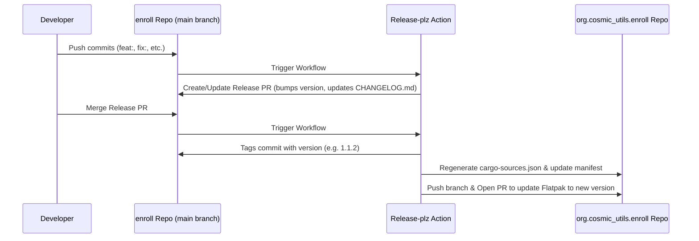

# Release Process

This repository utilizes automated releases powered by **release-plz** combined with a custom CI/CD pipeline that automatically proposes updates to the Flatpak manifest in [org.cosmic_utils.enroll](https://github.com/flathub/org.cosmic_utils.enroll).

---

## How It Works

1. **Commit Stage**: Developers push changes to the `main` branch.
2. **Release PR Creation**: On every push, `release-plz` checks for new commits, determines the next version bump based on Conventional Commits, updates `Cargo.toml`/`Cargo.lock` and `CHANGELOG.md`, and creates or updates a release Pull Request.
3. **Merging**: When you are ready to make a release, merge the release Pull Request.
4. **Tagging & Flatpak PR**: Once the release PR is merged, `release-plz` creates the Git tag. Immediately after, the CI pipeline checks out the Flatpak repository, regenerates `cargo-sources.json` based on the release's dependencies, updates `org.cosmic_utils.enroll.yml` with the new tag/commit, and opens a Pull Request on the Flatpak repository.

---

## Required Repository Configuration

To make this workflow function correctly, a few configuration steps must be performed in your GitHub repository settings:

### 1. Workflow Permissions
Go to `Settings` -> `Actions` -> `General` -> `Workflow permissions`:
- Set to **Read and write permissions**.
- Check **Allow GitHub Actions to create and approve pull requests**.

### 2. GitHub Fork & Personal Access Token (`GH_PAT`)
Since the workflow needs to push branches to your personal fork of the Flatpak repository, you must perform these setup steps:
1. Go to [flathub/org.cosmic_utils.enroll](https://github.com/flathub/org.cosmic_utils.enroll) and **fork** it under your personal GitHub account (`jotuel`).
2. Create a GitHub Personal Access Token (PAT) with write permission to your personal repositories (`repo` scope for classic tokens or a fine-grained token with access to your `org.cosmic_utils.enroll` fork).
3. Save this token as a Repository Secret in the `enroll` repository named **`GH_PAT`**.

---

## Commit Guidelines (Conventional Commits)

`release-plz` relies on Conventional Commits to automatically calculate version bumps and write changelogs. Use the following prefixes in your commit messages:

- **`feat: ...`**: Bumps the **minor** version (e.g., `1.1.1` -> `1.2.0`). Adds a "Features" section in the changelog.
- **`fix: ...`**: Bumps the **patch** version (e.g., `1.1.1` -> `1.1.2`). Adds a "Bug Fixes" section in the changelog.
- **`perf: ...`**: Bumps the **patch** version. Adds a "Performance Improvements" section in the changelog.
- **`docs: ...`**, **`style: ...`**, **`refactor: ...`**, **`test: ...`**, **`chore: ...`**: Usually do not trigger a release on their own, but will be listed in the changelog.
- **`BREAKING CHANGE: ...`** or appending a `!` (e.g., `feat!: ...`): Bumps the **major** version (e.g., `1.1.1` -> `2.0.0`).
