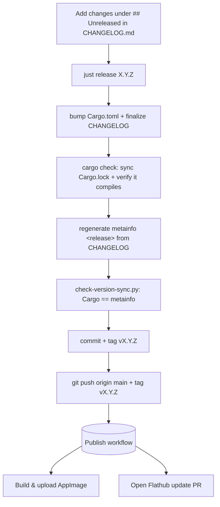

# Release Process

Releases are **tag-driven**. There is no release-plz: a maintainer runs one
command locally, and pushing the tag publishes everything.

## The invariant that matters

The Flathub build compiles the app from a git tag and ships the
`metainfo.xml` found at that tag. So **the commit a tag points at must already
contain the `<release>` entry for that version** — otherwise Flathub ships a
build whose latest `<release>` is stale and AppStream validation fails.

This was the bug that broke the old release-plz pipeline (it tagged from
`Cargo.toml` while the metainfo entry landed later, on a separate PR branch).
The new flow makes the invariant structural:



The tag is the **last** step, so it is impossible to tag a commit whose
metainfo is missing the release entry. `ci.yml` re-runs the same sync check on
every push/PR as defence in depth.

## Making a release

1. Add your release notes under a `## [Unreleased]` section at the top of
   `CHANGELOG.md` (Keep a Changelog style: `### Added`, `### Changed`,
   `### Fixed`, …).
2. From `main`, with a clean tree:

   ```sh
   just release 1.3.0
   ```

   The recipe bumps `Cargo.toml`, finalizes the CHANGELOG header, regenerates
   the metainfo `<release>`, runs `cargo check`, verifies version sync, then
   commits, tags `v1.3.0` and asks before pushing.
3. Confirm the push. The `Publish` workflow builds the AppImage and opens the
   Flathub update PR.

> Tags are `vX.Y.Z`. Older releases used bare `X.Y.Z` tags (history); new
> releases are all `v`-prefixed.

## The Publish workflow (`.github/workflows/publish.yml`)

Triggered by a `v*` tag push. Three **independent** jobs, so one failing never
silently skips another:

- **create-release** — creates the GitHub release (idempotent).
- **appimage** — `cargo build --release`, package with `appimagetool`, upload
  to the release. Needs `create-release` (a release must exist to attach to).
- **flathub** — regenerates `cargo-sources.json` with a **pinned +
  checksummed** cargo generator, updates the manifest, force-pushes to your
  fork and opens/updates the Flathub PR. Fully parallel to `appimage`.

## Required repository configuration

### `GH_PAT` (for the Flathub job only)

The workflow pushes to your fork `jotuel/org.cosmic_utils.enroll` and opens a
PR on `flathub/org.cosmic_utils.enroll` using a PAT. The PAT must have:

- **Contents: write** on `jotuel/org.cosmic_utils.enroll` (fine-grained), or
  the `repo` scope (classic).

Store it as the repository secret **`GH_PAT`**. If the Flathub job fails with
`403 ... denied to jotuel`, the PAT is missing this scope (this is exactly
what failed before).

### GitHub Actions settings

This workflow no longer creates pull requests with `GITHUB_TOKEN` (the Flathub
PR uses `GH_PAT`), so the repository setting
*Settings → Actions → General → Workflow permissions → Allow GitHub Actions to
create and approve pull requests* is **no longer required**. You may leave it
on or disable it; it does not affect this pipeline.

## Commit messages

Conventional Commit prefixes (`feat:`, `fix:`, …) are no longer required —
nothing auto-derives the version or changelog from them. They remain good
practice for a readable history, but the CHANGELOG is now written by hand and
the version is chosen explicitly via `just release`.
