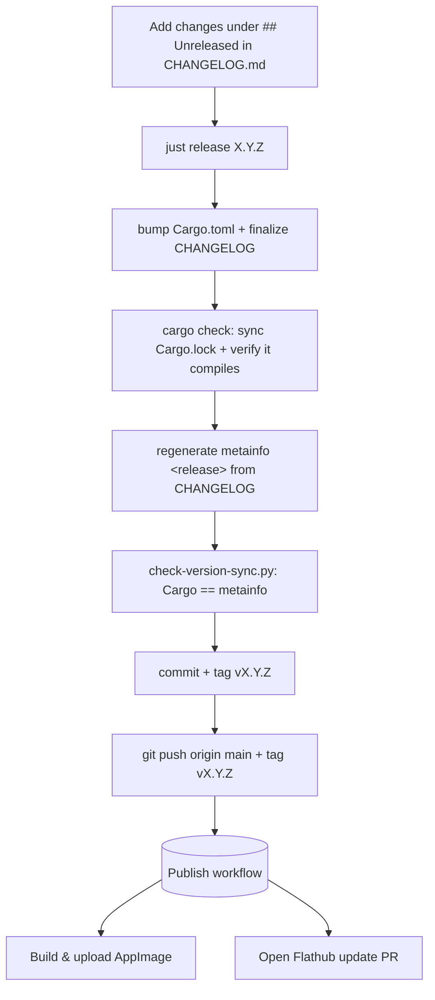

# Release Process

Releases are **tag-driven**. Maintainer runs one command locally, and pushing the tag publishes everything.

## The tag that matters

The Flathub build compiles the app from a git tag and ships the
`metainfo.xml` found at that tag. So **the commit a tag points at must already
contain the `<release>` entry for that version** — otherwise Flathub ships a
build whose latest `<release>` is stale and AppStream validation fails.



The tag is the **last** step, so it is impossible to tag a commit whose
metainfo is missing the release entry. `ci.yml` re-runs the same sync check on
every push/PR as defence in depth.

## Making a release

1. Add your release notes under a `## [Unreleased]` section at the top of
   `CHANGELOG.md` (Keep a Changelog style: `### Added`, `### Changed`,
   `### Fixed`, …).
2. From `main`, with a clean tree:

   ```sh
   just release 1.3.0
   ```

   The recipe bumps `Cargo.toml`, finalizes the CHANGELOG header, regenerates
   the metainfo `<release>`, runs `cargo check`, verifies version sync, then
   commits, tags `v1.3.0` and asks before pushing.
3. Confirm the push. The `Publish` workflow builds the AppImage and opens the
   Flathub update PR.

> Tags are `vX.Y.Z`. Older releases used bare `X.Y.Z` tags (history); new
> releases are all `v`-prefixed.

## The Publish workflow (`.github/workflows/publish.yml`)

Triggered by a `v*` tag push. Jobs are **independent** — one failing never
silently skips another:

- **create-release** — creates the GitHub release (idempotent).
- **appimage** — `cargo build --release`, package with `appimagetool`, upload
  to the release. Needs `create-release` (a release must exist to attach to).
- **flathub** — regenerates `cargo-sources.json` with a **pinned +
  checksummed** cargo generator, updates the manifest, then uses
  [`peter-evans/create-pull-request`](https://github.com/peter-evans/create-pull-request)
  to push an update branch directly to `flathub/org.cosmic_utils.enroll` and
  open/update the PR there (no fork — the Flathub maintainer pattern). Fully
  parallel to `appimage`.
- **vendor-tar** — runs `just vendor` (with VERGEN pinned to the tag commit)
  and uploads `vendor.tar` to the release. Enabler for `copr` and
  `launchpad`, which build offline because libcosmic is a git dep. Needs
  `create-release`.
- **aur** — stamps the rendered PKGBUILD (`packaging/aur/PKGBUILD`) with the
  version + source-tarball sha256, regenerates `.SRCINFO`, and pushes to the
  AUR package over SSH. Needs `create-release`.
- **copr** — builds an SRPM from the spec (`packaging/copr/*.spec`) using the
  tag source + `vendor.tar`, submits it to Copr via `copr-cli`. Needs
  `vendor-tar`.
- **launchpad** — rolls a Debian source package (`packaging/debian/*`) with
  vendored deps inside the orig tarball, signs with GPG, and `dput`s to the
  PPA. Needs `vendor-tar`.

The AUR/Copr/Launchpad targets are documented in
[`packaging/README.md`](packaging/README.md).

## Required repository configuration

### `GH_PAT` (for the Flathub job only)

The workflow pushes a branch directly to `flathub/org.cosmic_utils.enroll`
and opens the PR there (no fork), using a PAT. Your account already has write
access to the Flathub repo (standard for the upstream author), so a **classic
PAT with the `repo` scope** is all that's needed — the classic `repo` scope
inherits your collaborator rights and works against the Flathub repo at
runtime.

> **Use a classic PAT, not fine-grained.** Fine-grained PATs can only target
> repositories you *own*, so `flathub/org.cosmic_utils.enroll` (where you're a
> collaborator, not the owner) does not appear in their repository picker. A
> classic PAT with `repo` scope has no such limitation. This is why the
> Flathub docs say *"the maintainer can use their personal token for this."*

Create it at *Settings → Developer settings → Personal access tokens → Tokens
(classic)*, give it the **`repo`** scope, and store it as the repository
secret **`GH_PAT`**. If the Flathub job fails with `403 ... denied to
flathub`, the PAT is missing the `repo` scope.

### Native packaging secrets (AUR / Copr / Launchpad)

These power the four native-distro jobs added with the packaging in
`packaging/`. Create each as a repository secret under *Settings → Secrets
and variables → Actions*. The jobs run without the ones they don't need, so
you can roll them out one distro at a time.

| Secret | Job | What it holds |
|---|---|---|
| `AUR_SSH_KEY` | `aur` | Private SSH key whose public half is registered on your AUR account (*My Account → SSH Public Keys*). Used to clone+push `aur@aur.archlinux.org`. |
| `COPR_API_TOKEN` | `copr` | The full `~/.config/copr` INI from Copr → *My Account → API* (holds `login`, `token`, `username`, `copr_url`). Paste as one multiline secret. |
| `LP_GPG_KEY` | `launchpad` | ASCII-armored private key registered to the Launchpad account that owns the PPA (*Your profile → OpenPGP keys*). Signs the `.changes`. |
| `LP_GPG_PASSPHRASE` | `launchpad` | Passphrase for `LP_GPG_KEY`. |

Optional **repository variables** (not secrets) under *Settings → Secrets
and variables → Actions → Variables*:

| Variable | Job | Default | Purpose |
|---|---|---|---|
| `COPR_PROJECT` | `copr` | `enroll` | `owner/project` to submit to if you don't host it as `enroll` under your own account. |
| `DEB_SERIES` | `launchpad` | `plucky` | Ubuntu series to target. Constrained to 25.04+ by Rust edition 2024. |
| `LP_DPUT_HOST` | `launchpad` | `ppa:cosmic-utils/enroll` | `dput` host entry / PPA name. |

> The Launchpad upload must be signed by a key registered to the *same*
> Launchpad account that owns the PPA, or `dput` rejects it server-side.

The native package targets themselves (the AUR package, the Copr project, the
PPA) are one-time out-of-band setup — see `packaging/README.md`.
