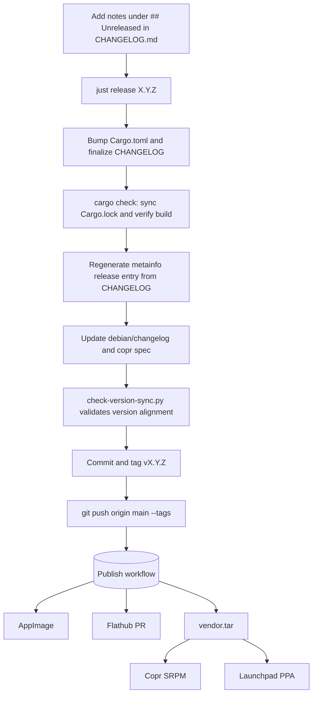

# Release process

Releases are tag-driven: run one command locally, confirm the prompt, and pushing the tag handles publishing across Flathub, AppImage, Copr, and Launchpad.

Flathub builds directly from git tags and validates `metainfo.xml` against the tagged commit. Because of this, the commit targeted by the tag must already contain the `<release>` entry for that version, or AppStream validation fails and rejects the build.



Because tagging happens as the final step in the script, you won't accidentally push a tag with out-of-sync metadata. CI also runs `check-version-sync.py` on pull requests to catch version drift before tagging.

## Making a release

1. Write your release notes under a `## [Unreleased]` section at the top of `CHANGELOG.md` (following Keep a Changelog: `### Added`, `### Changed`, `### Fixed`, etc.).
2. On `main` with a clean working tree, run:

   ```sh
   just release 1.3.0
   ```

   The recipe bumps `Cargo.toml`, stamps the changelog header, regenerates the metainfo XML, updates both `packaging/debian/changelog` and `packaging/copr/cosmic-utils-enroll.spec`, runs `cargo check`, verifies version sync across every file, creates the commit, and tags `v1.3.0`. It prompts for confirmation before pushing.
3. Confirm the push. GitHub Actions picks up the tag and runs `.github/workflows/publish.yml`.

Note: Tags use `vX.Y.Z` format. Earliest releases used bare version tags, but everything going forward uses the `v` prefix.

## The publish workflow

Pushing a `v*` tag triggers the jobs in `.github/workflows/publish.yml`. Jobs run independently; a failure in one target won't stop the others from finishing:

- **create-release**: Creates the GitHub release entry if missing.
- **appimage**: Compiles with `--release`, packages via `appimagetool`, and uploads to the GitHub release.
- **flathub**: Re-generates pinned `cargo-sources.json`, bumps the Flathub manifest, and opens an update PR on `flathub/org.cosmic_utils.enroll` using `create-pull-request`.
- **vendor-tar**: Runs `just vendor` with `SOURCE_DATE_EPOCH` and `SOURCE_GIT_HASH` tied to the release commit, uploading `vendor.tar` for offline distro builds.
- **copr**: Takes the tagged source and `vendor.tar`, generates an SRPM from `packaging/copr/*.spec`, and submits it to Copr.
- **launchpad**: Combines the upstream source and vendored crates into a Debian source package, signs it with your GPG key, and uploads it to the PPA via `dput`.

For distro packaging details and local test builds, see [`packaging/README.md`](packaging/README.md).

## Required repository configuration

### `GH_PAT` (Flathub job)

The workflow opens a PR directly against `flathub/org.cosmic_utils.enroll` without a fork. As an upstream maintainer, you already have collaborator permissions on that repository.

A classic personal access token with `repo` scope is required. Do not use fine-grained tokens here: fine-grained PATs cannot target repositories owned by other organizations where you are only a collaborator.

Generate the token at *Settings → Developer settings → Personal access tokens → Tokens (classic)*, check the `repo` scope, and add it under repository secrets as `GH_PAT`. If the workflow throws a 403 error during PR creation, the token is likely missing this scope or expired.

### Native packaging secrets

Configured under *Settings → Secrets and variables → Actions*. If you only maintain one distro target, you can omit the secrets for the other.

| Secret | Job | Description |
|---|---|---|
| `COPR_API_TOKEN` | `copr` | Full INI contents of `~/.config/copr` from Copr (*My Account → API*). Stored as a single multiline secret. |
| `LP_GPG_KEY` | `launchpad` | ASCII-armored private key uploaded to Launchpad (*Your profile → OpenPGP keys*). Used to sign `.changes`. |
| `LP_GPG_PASSPHRASE` | `launchpad` | Passphrase for `LP_GPG_KEY`. |

Optional repository variables (under *Settings → Secrets and variables → Actions → Variables*):

| Variable | Job | Default | Purpose |
|---|---|---|---|
| `COPR_PROJECT` | `copr` | `enroll` | Copr project name (`owner/project`) if different from default. |
| `DEB_SERIES` | `launchpad` | `plucky` | Ubuntu series name. Must be 25.04 or newer due to Rust 2024 edition requirements. |
| `LP_DPUT_HOST` | `launchpad` | `ppa:cosmic-utils/enroll` | Target PPA name for `dput`. |

Note: Launchpad requires uploads to be signed by a key registered to the Launchpad account owning the destination PPA. Unmatched keys are rejected on upload.
